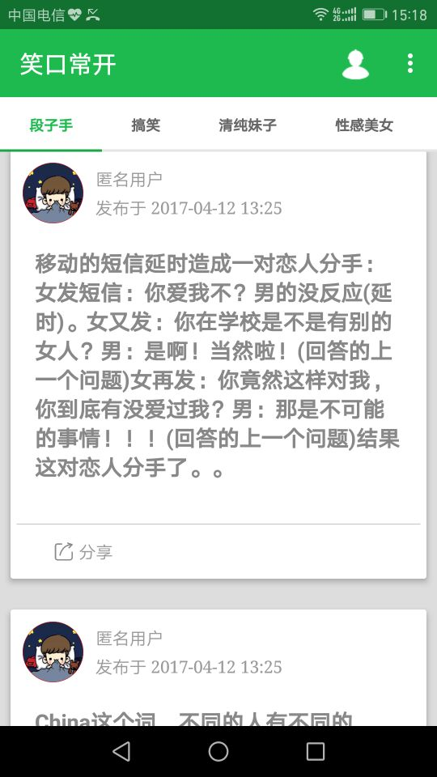
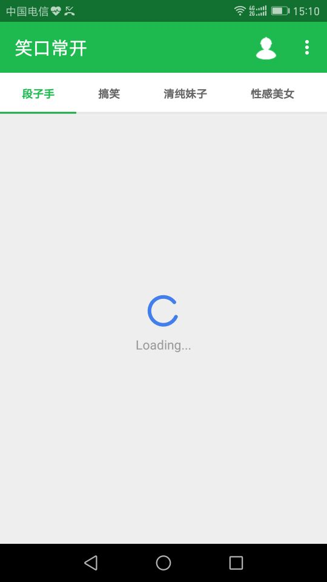
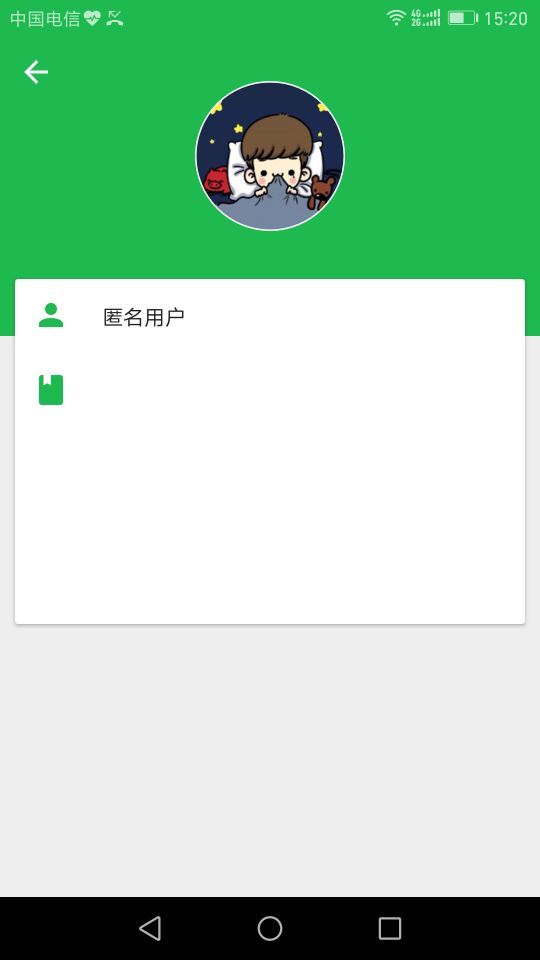

# FunN
（因为 数据来源，接口，app都是本人独立完成，所以可能更新会很慢，请见谅） 
 
描述：这是一款基于MVP模式开发的,目的是给用户带来快乐，其中有
        <item>段子手</item>,
        <item>搞笑</item>,
        <item>清纯妹子</item>,
        <item>性感美女</item>,
        <item>动态图</item>,
        <item>邪恶图片</item>
几个模块，包括了文字笑话，搞笑图片，美女图片，搞笑动态图. 
 
##### 功能
只是提供了文字小号的分享，图片和gif的等浏览和下载功能。
 
####  准备新增功能
* 用户管理（支持第三方登陆）. 
* 支持图片和gif分享到第三方软件（sharesdk） 
* 添加搞笑视频模块 
* 用户发表功能 
* 用户评论功能 
 

#### 所以说还有很长的路要走
 

## 预览

## 实现架构

### 数据层面

应用除了对少数内容进行缓存，其他内容均直接从网络获取。

- 使用 Volley 及部分自定义增强处理网络请求。
- 使用 Gson 自动填充数据模型。
- 使用 ImageLoader 加载图片。
- 使用 fresco 和android-async-http 加载gif.
- 使用 EventBus 同步不同页面间对象状态。

### 界面层面

使用 Support Library 中的 AppCompat、Design、CardView、RecyclerView 进行 Material Design 实现，在必要时引入/自己写作第三方库以实现部分界面元素和效果。

界面实现一般分为 Activity、Fragment、Adapter 三个模块，分别负责作为容器，发起请求、展示数据和用户交互，以及数据/交互绑定。

## 第三方库
- [PhotoView](https://github.com/chrisbanes/PhotoView)
- [Gson](https://github.com/google/gson)
- [ButterKnife](https://github.com/JakeWharton/butterknife)
- [Volley](https://github.com/mcxiaoke/android-volley)
- [EventBus](https://github.com/greenrobot/EventBus)
- [SwipeRefreshLayout](https://github.com/hanks-zyh/SwipeRefreshLayout)
- [PagerSlidingTab](https://github.com/astuetz/PagerSlidingTabStrip)
- [CircularImageView](https://github.com/lopspower/CircularImageView)
- [android-gif-drawable](https://github.com/koral--/android-gif-drawable/)
- [RippleEffect](https://github.com/traex/RippleEffect)
- [RippleEffect](https://github.com/chrisbanes/PhotoView)
- [materialiconlib]
- [SuperToasts ](https://github.com/JohnPersano/SuperToasts)
- [material-ripple](https://github.com/balysv/material-ripple)
- [Material](https://github.com/rey5137/material)

 

## 数据来源

应该有很多人都关心数据来源吧！这里我要说下： 
 
数据是自己爬的（python 写的），至于爬的那些网站和具体的内容，就不多说了，下面是爬虫下载地址，有兴趣的可以下载下来看看：

- [python_fun](https://github.com/skcodestack/python_fun)

 

## 接口

因为接口比较简单，我就没有上传上来，下面我就具体说下接口中使用的到的知识吧！

- 没有使用框架，使用Servlet来写的，返回json数据
- 数据库使用的是mysql，也就是上面爬虫保存数据的地方
- 为了减少访问mysql的次数，使用redis经行缓存（只缓存每个模块的首页数据，且定时对redis中数据进行更新)

#### 准备新增功能
- 服务器集群(nginx+tomcat)
- 文件分布式存储，准备使用taobao的fastDFS
- 对redis进行优化
- 对mysql进行优化（比如读写分离等）

